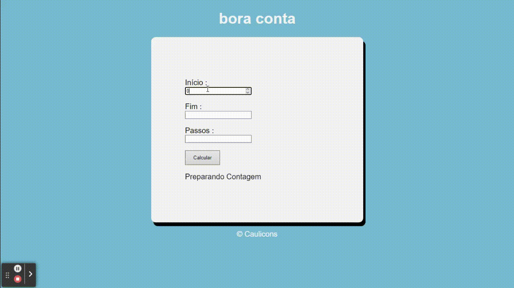

# Contador 

Repassando aqui esse mini-projeto que fiz vendo os cursos do canal do YouTube: Curso em Vídeo, do professor Gustavo Guanabara na playlist de JavaScript patrocinada pelo Google.

Esse mini-projeto foi ótimo para dá aquela revisada básica em tratamentos de dados, e lógica de programação com JS. Também tive o primeiro contador com Unicode, um emoji sempre ajuda a expressa melhor 😎.

Caso queiram da uma olhada no site, só clicar [aqui](https://lnkd.in/g2RA842S).
